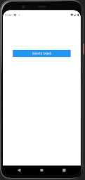
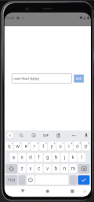
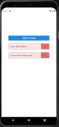

**Coding a simple React-Native App through Expo platform**

 

> Using new React-Native components like ScrollView, "Touchable" components or custom components
>
> Learning deeper FlatList concept and use
>
> Testing mobile rendering with Expo App or Virtual Android

 

Thx to [Academind Tuto](https://www.youtube.com/watch?v=qSRrxpdMpVc) 😉

 

 &ensp; &ensp;  &ensp; &ensp; 
